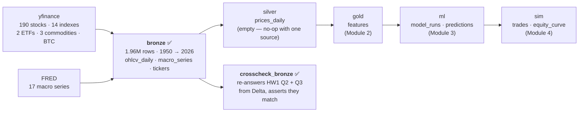

# Stock Markets Analytics Zoomcamp — 2026 cohort

My work through [DataTalks.Club's Stock Markets Analytics Zoomcamp](https://github.com/DataTalksClub/stock-markets-analytics-zoomcamp),
a five-module course on building and backtesting equity trading strategies.

This is a fork of the course repo. Rather than working in notebooks and throwing
them away, I'm building the coursework on a **Databricks lakehouse** — a Unity
Catalog medallion layout deployed as infrastructure-as-code, so each module's data
lands somewhere the next module can query.

> **Everything I wrote lives in [`my-notes/`](../my-notes/).** Everything else is
> the course's own material, mirrored unmodified.

---

## What's here

| | |
|---|---|
| **[Homework 1](../my-notes/01-intro/homework1.ipynb)** | Four answers, reproducible, runs in three environments |
| **[Databricks lakehouse](../my-notes/databricks/)** | 6 schemas, 3 volumes, 8 tables, 4 jobs — all as code |
| **[Engineering log](../CLAUDE.md)** | Every dead end and gotcha, written down |
| **[Course brief](../my-notes/2026-prep-brief.md)** | Deadlines, rules, time budget |
| **[Handoff](../my-notes/HANDOFF.md)** | What's done, what's next, what's broken |

## The data platform



Bronze is loaded and verified. The rest of the spine is created but empty — it
fills as the modules land, and the diagram says so rather than implying otherwise.

Everything is declared in a [Databricks Asset Bundle](../my-notes/databricks/bundle/):
schemas, volumes and grants declaratively, tables via an idempotent DDL job, and
four jobs — bootstrap, verify, ingest, cross-check. `bundle deploy` reproduces the
whole layout on an empty workspace.

## Results — Module 1

| Q | Question | Answer | Checked how |
|---|---|---|---|
| 1 | Year with most S&P 500 additions since 2020 | **2025** (18) | structural — 503 constituents, 100% of dates parsed |
| 2 | Indexes beating the S&P 500 YTD | **2** | **independently reproduced from Delta** |
| 3 | Median drawdown of corrections of at least 5% | **7.99%** | **all 10 published corrections reproduced exactly, in CI** |
| 4 | Median 2-day return after a positive earnings surprise | **0.35%** | structural — 20 positive surprises of 24 announcements |

Q3 is the one worth clicking through. The question ships a table of the ten largest
S&P 500 corrections since 1950; the notebook reproduces every one — peak date,
trough date, drawdown and duration — before reporting its own answer. That is not
just a printout: the algorithm lives in [`my-notes/lib/corrections.py`](../my-notes/lib/corrections.py)
and [a unit test](../my-notes/tests/test_corrections.py) asserts all ten against
pinned price data on every push.

Q2 and Q3 are then recomputed a second time, from `bronze.ohlcv_daily` instead of
from the live API, by the [`crosscheck_bronze`](../my-notes/databricks/bundle/src/06_crosscheck_bronze.py)
job. Q2 matches exactly; Q3 agrees to 0.004 percentage points. Q1 and Q4 need
Wikipedia and an earnings calendar, neither of which is in bronze — the job reports
that rather than quietly covering two of four.

## Run it

**Locally** — conda, and the only environment where the whole repo works:

```bash
conda env create -f my-notes/environment.yml
conda activate stock-markets-analytics
jupyter lab my-notes/01-intro/homework1.ipynb
```

**Google Colab** — one click, nothing to install:

[](https://colab.research.google.com/github/jschuller/stock-markets-analytics-zoomcamp/blob/main/my-notes/01-intro/homework1.ipynb)

**Databricks Free Edition** — the same notebook, unchanged:

```bash
export DATABRICKS_CONFIG_PROFILE=free-edition
cd my-notes/databricks
./push_notebooks.sh                                    # -> /Users/<you>/sma-zoomcamp/
cd bundle && databricks bundle deploy -t free-edition
databricks bundle run ingest_bronze     -t free-edition
databricks bundle run crosscheck_bronze -t free-edition
```

`homework1.ipynb` detects which of the three it is running in and installs only
what is missing. **Verified end-to-end on all three** — the same notebook returns the
same four answers on local Jupyter, Google Colab and Databricks serverless, across
Python 3.11 and 3.13, pandas 2.2 and 2.3, and yfinance 0.2 and 1.6. The stack differs
by a major version in places; the answers do not move.

## Field notes

Things that cost me time, so they don't cost you any. Full detail in
[`CLAUDE.md`](../CLAUDE.md), which is the file Claude Code auto-loads and doubles
as this project's engineering log.

- **Stooq is dead.** `data_repo.py`'s yfinance → Stooq → FRED fallback has a broken
  middle tier: a JS proof-of-work challenge from a home IP, a MySQL error from
  Databricks. Two networks, both dead.
- **yfinance 404s live symbols.** `MMC`, `FI` and `BK` all fail at Yahoo's *own*
  chart endpoint, from two networks, at every start date. Check the raw endpoint
  before debugging client code. 187 of 190 tickers load.
- **`data_repo.py` lists `SNYS`, which doesn't exist** — it's `SNPS` (Synopsys).
- **`%pip install` aborts a whole Databricks run** on failure. Shell out through
  `subprocess` if you want to inspect the failure instead of dying on it.
- **`print()` doesn't survive the Databricks Jobs API.** Notebooks run as jobs must
  end with `dbutils.notebook.exit(json.dumps(...))` or you get nothing back.
- **A Databricks Asset Bundle *is* Terraform** under the hood — which is exactly why
  there's no separate Terraform config here.
- **`gh` talks to upstream, not your fork,** when a repo has two remotes. Both
  failure modes look like auth problems and aren't. Pass `-R owner/repo`.
- **`pd.read_html` on Wikipedia is HTTP 403** without a browser `User-Agent`.

## Layout

```
my-notes/                    everything I wrote
├── 01-intro/                Module 1 — notes, homework, data
│   └── homework1.ipynb      the submission, generated by tools/build_homework1.py
├── databricks/              the lakehouse
│   ├── bundle/              Asset Bundle: schemas, volumes, jobs, notebooks
│   ├── CATALOG_LAYOUT.md    why the layout is shaped this way
│   └── push_notebooks.sh    coursework notebooks -> workspace
├── 2026-prep-brief.md       deadlines, certification rules, time budget
├── environment.yml          local conda env (read the pin comments)
└── HANDOFF.md               current state and next actions

.github/workflows/           CI: validate + plan on PRs, deploy on merge
CLAUDE.md                    engineering log / AI context
```

Everything outside `my-notes/` — the numbered module directories, `cohorts/`,
`projects/`, `README.md` — is upstream's, byte for byte. That is deliberate: it
makes `git merge upstream/main` a clean merge every week. The rule is *never modify
a file upstream owns; adding new ones is free*, which is why `.github/`, `CLAUDE.md`
and this page can exist without ever causing a conflict.

Verify it yourself:

```bash
git diff --stat upstream/main -- 01-intro-and-data-sources 02-dataframe-analysis \
  03-modeling 04-trading-strategy-and-simulation 05-deployment-and-automation \
  cohorts projects README.md          # empty output = mirror intact
```

## Credit

Course material, notebooks and homework questions are the work of
**[Ivan Brigida](https://pythoninvest.com/)** and
**[DataTalks.Club](https://datatalks.club/)** — see
[the upstream repo](https://github.com/DataTalksClub/stock-markets-analytics-zoomcamp)
and [the original README](../README.md). I claim none of it.

My own additions — everything under `my-notes/`, plus `CLAUDE.md` and the workflows
— are MIT licensed. See [`LICENSE`](../LICENSE).

**Nothing here is investment advice.**
